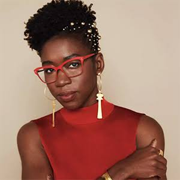
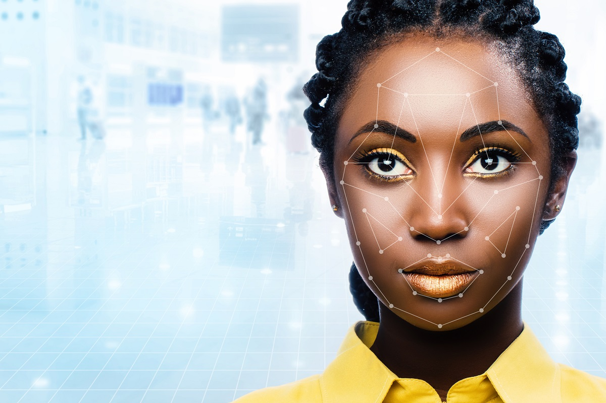

  
# Joy Buolamwini: Gender Shades
**Integrantes:** Ángel Gabriel Rubiano García, Mariana Bueno López, Simón Serna Valencia y Sofía Suárez Beltrán

  

## ¿Quién es Joy Buolamwini?
Es una cientifica informática, investigadora y activista digital, reconocida por su trabajo en la identificación y denuncia del sesgo algorítmico y de género en los sistemas de inteligencia artificial, especialmente en el reconocimiento facial.

### Trayectoria
- **Estudios**
    - Hizo una licenciatura en Ciencias de la Computación en Georgia Tech en el año 2012.
    - Hizo una maestría en Oxford como Rhode Scholar en el año 2013.
    - Hizo un doctorado en el MIT Media LAb entre los años 2015 y 2022.

- **Trabajos importantes**
    - Fundo la Algorithmic Justice League, la cual funciona para denunciar los diferentes sesgos que puede haber en la inteligencia artificial.
    - Su investigación conocida como "Gender Shades" la cual mostro que el reconocimiento facial fallaba en gran parte con mujeres de piel oscura.

- **Otros logros**
    - Es la autora del libro "Unmasking IA"
      
  
  
## Problemática
Durante el entrenamiento de algunos de los sistemas de reconocimiento facial se utilizaron en su mayoría datos de personas del género masculino y personas de piel clara, es     decir, no representa de manera equilibrada a toda la población, y por esta razón, dichos sistemas pueden reproducir los sesgos y desigualdades que se perciben en nuestra sociedad. 

Como consecuencia, algunas tecnologías podían estar más expuestas a una mayor tasa de error al identificar ciertos grupos poblacionales, específicamente personas de piel        oscura y mujeres. Esto se convierte en problemas muchísimo más graves cuando estos sistemas de identificación son usados para tomar decisiones que puedan afectar directamente   a personas, como en procesos policiales o de seguridad (Mosley, 2023). 

El interés de Joy Buolamwini para estudiar los sesgos de la inteligencia artificial nació mientras ella realizaba un proyecto artístico en el MIT Media Lab, donde los           computadores usaban sistemas de reconocimiento facial. Ella se dio cuenta de que dichos sistemas de reconocimiento no detectaban su rostro, por lo que creyó que se trataba de    un error en el sistema. Pero al investigar más a fondo, esto se trataba de un sesgo que tenía el sistema para detectar su rostro, al ser una mujer de piel oscura (Mosley,       2023). 

  

  
 
 

## Proyecto

### ¿De qué trata el proyecto?
*Gender Shades* es un proyecto de investigación liderado por Joy Buolamwini, con Timnit Gebru como coautora, que analiza el rendimiento de sistemas comerciales de análisis facial según el género y el tono de piel. El trabajo fue publicado en 2018. (Buolamwini & Gebru, 2018).

### ¿Quiénes participaron?
El proyecto contó principalmente con Joy Buolamwini y Timnit Gebru. También participaron Helen Raynham como experta clínica, Deborah Raji en operaciones de datos y Ethan Zuckerman como asesor.(Gender Shades, 2018).

 Personas que participaron 

  
- *Joy Buolamwini*: autora principal e investigadora.

- [*Timnit Gebru*](https://es.wikipedia.org/wiki/Timnit_Gebru): coautora e investigadora.

- [*Helen Raynham*](https://rhodesproject.squarespace.com/helen-raynham-profile): experta clínica.

- [*Deborah Raji*](https://www.knightcolumbia.org/bios/view/deborah-raji): operaciones de datos.

- [*Ethan Zuckerman*](https://ethanzuckerman.com/about-me/): asesor.
  

### ¿Cómo se desarrolló?
Después de identificar la problemática, los investigadores analizaron los conjuntos de datos disponibles para evaluar sistemas de reconocimiento facial. Encontraron que algunos tenían una representación desigual de la población, por lo que desarrollaron el ***Pilot Parliaments Benchmark*** 
**(PPB)**.(Buolamwini & Gebru, 2018).

> El PPB contiene 1.270 imágenes de personas y fue diseñado para permitir una evaluación más equilibrada según género y tono de piel (Buolamwini & Gebru, 2018).

Posteriormente, utilizaron este conjunto de datos para evaluar tres sistemas comerciales de clasificación de género desarrollados por IBM, Microsoft y Face++. Compararon los resultados obtenidos por cada sistema y analizaron sus tasas de error entre diferentes grupos.(Buolamwini & Gebru, 2018)

**El proceso fue:**

  
***Conjunto de datos***

:arrow_down:

***Sistemas de análisis facial*** 

:arrow_down:

***Resultados***

:arrow_down:

***Comparación de errores***

:arrow_down:

***Análisis de diferencias***
  

### ¿Cuántas etapas tuvo?
No existe una fuente oficial que establezca un número determinado de etapas para *Gender Shades*. Sin embargo, para explicar su desarrollo se puede organizar el proceso en:

**1.** Análisis de la problemática.

**2.** Revisión de los conjuntos de datos existentes.

**3.** Creación del PPB.

**4.** Evaluación de los sistemas comerciales.

**5.** Comparación y análisis de los resultados.

**6.** Publicación de los resultados.

Estas etapas son una forma de organizar el proceso de investigación, no una división oficial hecha por los autores.

### ¿Qué encontraron?
Los resultados mostraron diferencias importantes en el rendimiento de los sistemas. Los tres sistemas evaluados presentaron sus mayores tasas de error al clasificar a mujeres de piel más oscura (Buolamwini & Gebru, 2018).

> En uno de los resultados reportados, la tasa de error llegó hasta 34,7 % para mujeres de piel más oscura, mientras que el máximo registrado para hombres de piel más clara fue de 0,8 % (Buolamwini & Gebru, 2018).

Esto demostró que la precisión general de un sistema puede ocultar diferencias importantes entre grupos.

### ¿A quién ayuda?
El proyecto proporciona información útil para investigadores, desarrolladores y empresas que trabajan con inteligencia artificial, ya que muestra la importancia de evaluar los sistemas utilizando datos representativos y de analizar su rendimiento en diferentes grupos.(Buolamwini & Gebru, 2018).

También es relevante para las personas que utilizan estas tecnologías, porque permite identificar diferencias de rendimiento que podrían pasar desapercibidas al observar únicamente la precisión general.

### ¿Qué impacto tuvo?
*Gender shades* contribuyó a visibilizar los problemas de rendimiento desigual en sistemas comerciales de análisis facial y a impulsar una evaluación más detallada de estos sistemas (Buolamwini & Gebru, 2018).

Además, después de que se publicaran los resultados, las empresas cuyos sistemas fueron evaluados realizaron cambios en sus tecnologías. Investigaciones posteriores encontraron mejoras en el rendimiento y una reducción de las diferencias entre grupos.(Actionable Auditing, 2023).

### ¿Por qué es importante para la ciencia de datos?
El proyecto demuestra que en ciencia de datos no basta con conocer qué tan preciso es un modelo en general. También es necesario analizar para quién funciona, con qué precisión y qué grupos pueden verse más afectados por sus errores.

> [!NOTE]
> **Idea principal:** no basta con conocer la precisión general de un modelo; también es necesario analizar cómo funciona para diferentes grupos.

  
## Conclusión
En conclusión, Joy Buolamwini detectó que los sistemas de reconocimiento facial fallan con quienes no se ajustan a los conjuntos de datos predeterminados, generando sesgos que constituyen más que un problema técnico, ya que esto puede transformarse en desigualdades y discriminación sobre ciertos grupos. Gracias a su proyecto Buolamwini no solo visibilizó el problema, sino que auditó grandes empresas tecnológicas para que estas revisarán y mejorarán sus tecnologías de reconocimiento facial, enfatizando en la necesidad de regular la IA para asegurar que su uso sea ético y vaya de la mano con los derechos humanos de todo individuo sin importar su género o su raza.

## Referencias Bibliográficas

  
  Haz clic para desplegar las referencias bibliográficas 

  
  - Mosley, T. (2023, noviembre 28). 'Unmasking AI' author Joy Buolamwini says prejudice is baked into technology. NPR. Retrieved October 7, 2026, from https://www.npr.org/2023/11/28/1215529902/unmasking-ai-facial-recognition-technology-joy-buolamwini
  - Oxford AI Ethics. (s. f.). Doctor Joy Buolamwini. Accelerator Fellowship Programme, Institute for Ethics in AI, University of Oxford. https://afp.oxford-aiethics.ox.ac.uk/people/dr-joy-buolamwini
- MIT Media Lab. (2018, 27 de junio). 35 Innovators Under 35 | Visionaries | Joy Buolamwini. https://www.media.mit.edu/articles/35-innovators-under-35-visionaries-joy-buolamwini/
- Carnegie Corporation of New York. (2020). Joy Buolamwini. Great Immigrants. https://carnegie.org/great-immigrants/joy-buolamwini/
- Forbes. (s. f.). Joy Buolamwini. https://www.forbes.com/profile/joy-buolamwini/
- TIME. (2023). Joy Buolamwini: The 100 Most Influential People in AI 2023. https://time.com/collections/time100-ai/6310661/joy-buolamwini-ai/
- Buolamwini, J., & Gebru, T. (2018). Gender Shades: Intersectional Accuracy Disparities in Commercial Gender Classification. Proceedings of Machine Learning Research, 81, 77–91. https://proceedings.mlr.press/v81/buolamwini18a.html
- Gender Shades. (2018). Gender Shades. https://gendershades.org/
- MIT Media Lab. (s. f.). Gender Shades.https://www.media.mit.edu/projects/gender-shades/overview/
- MIT Media Lab. (s. f.). Gender Shades: Frequently Asked Questions. https://www.media.mit.edu/projects/gender-shades/faq/
- MIT Media Lab. (s. f.). Gender Shades: Press Kit.   https://www.media.mit.edu/projects/gender-shades/press-kit/
- MIT Media Lab. (s. f.). Actionable Auditing: Coordinated bias disclosure study. https://www.media.mit.edu/projects/actionable-auditing-coordinated-bias-disclosure-study/overview/

</detaisl>

